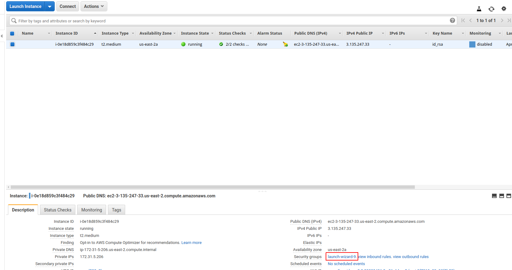
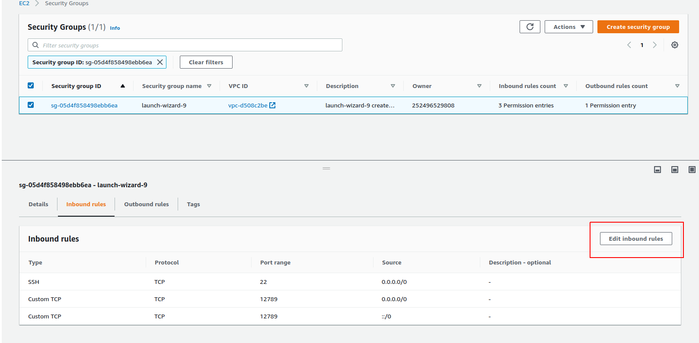
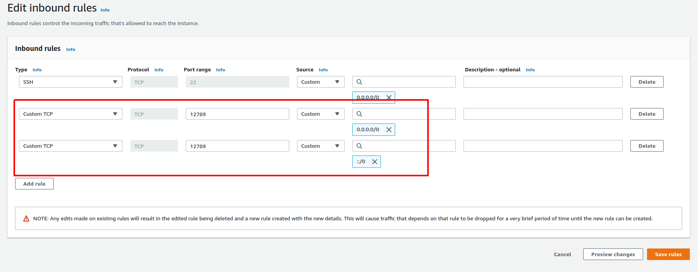
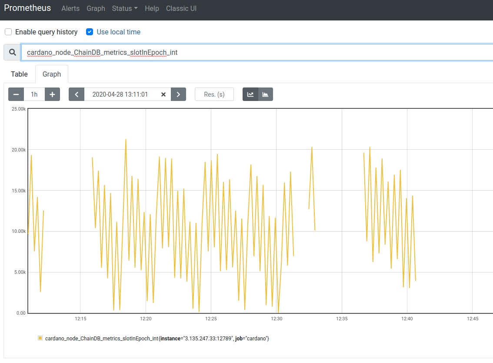

# Monitoring a Node with Prometheus

1. In contrast to EKG, Prometheus allows monitoring a Cardano Node running on an AWS instance without
   the need for port forwarding.
   We do however need to configure the AWS firewall to open the right port.
   If we want to use port 12789, we have to add a new _inbound rule_ to the _launch wizard_
   of our browser.

   You can find the link in the _Instances_ dashboard of the AWS console

   

   Click "Edit inbound rules".

   

   Then add a new rule for "Custom TCP", port range 12789, source "Anywhere".

   

2. On the AWS instance we edit the node configuration file shelley_testnet-config.json providing the host and port:

        hasPrometheus:
          - "0.0.0.0"
          - 12789

   (Using `0.0.0.0` as host will bind to all provided interfaces, all of which you can list with `ifconfig`.
   You can be more selective if you want and provide a specific IP-address instead.)

3. We restart the node, and it will now make Prometheus metrics available
   at port 12789 (or whatever port you specified in `shelley_testnet-config.json`).

4. You need to have Prometheus installed on your local machine.
   How to do this depends on your platform and setup, but you can find documentation
   [here](https://prometheus.io/docs/prometheus/latest/getting_started/).

5. Prometheus needs to be configured to monitor our Cardano Node. A minimalistic configuration file
   doing this could look like this:

        global:
          scrape_interval:     15s
          external_labels:
            monitor: 'codelab-monitor'

        scrape_configs:
          - job_name: 'cardano'
            scrape_interval: 5s
            static_configs:
              - targets: ['a.b.c.d:12789']

   You have to replace `a.b.c.d` with the public IP-address of your AWS instance,
   which you can find on the dashboard under _IPv4 Public IP_.

6. Start Prometheus with this configuration, open `localhost:9090`, pick one or more interesting metrics to graph
   and enjoy!

   
